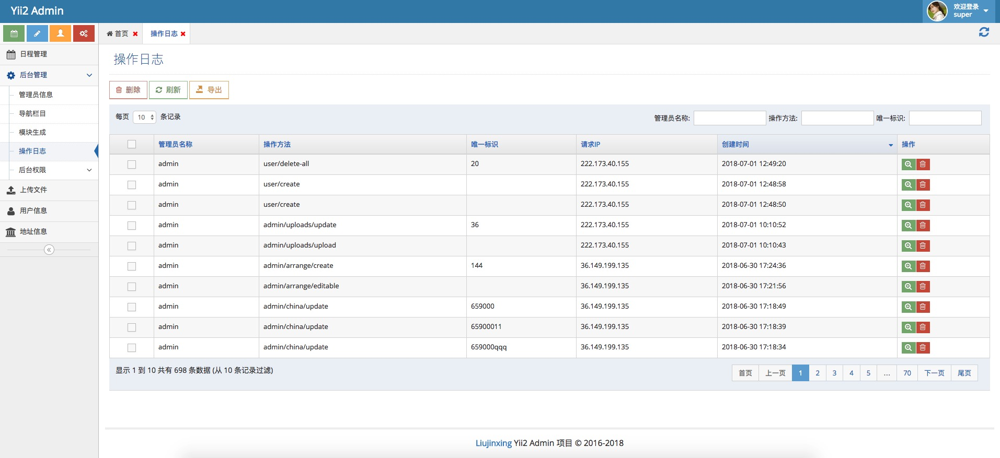
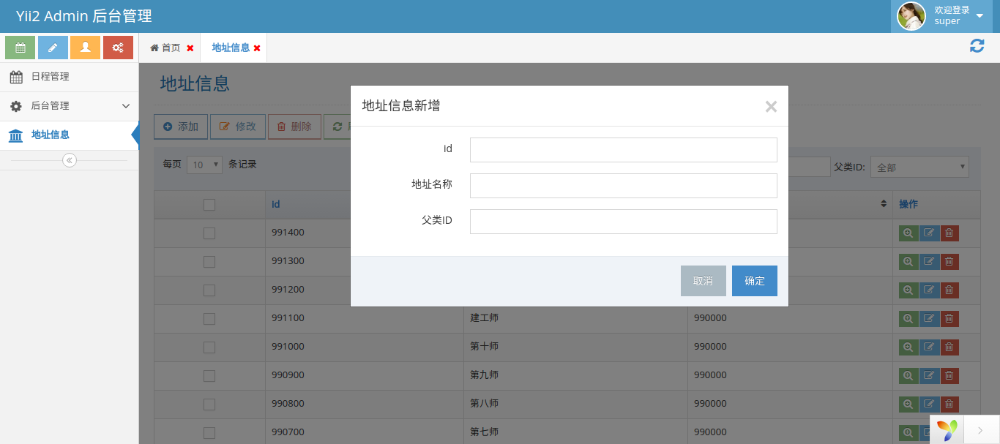
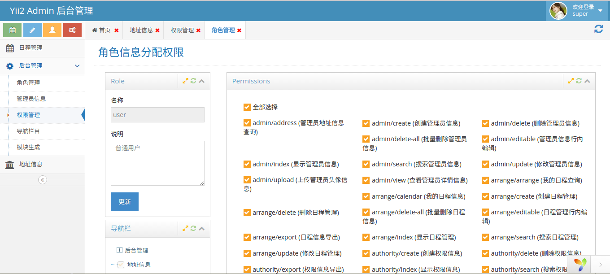
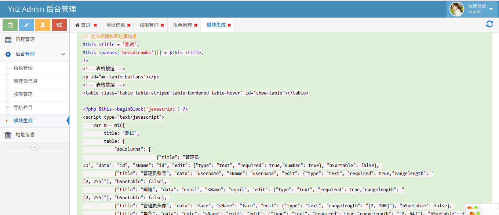

Yii2 Ace Admin 后台模板
=======================
[](https://packagist.org/packages/liujx/yii2-app-advanced)
[](https://packagist.org/packages/liujx/yii2-app-advanced)
[](https://packagist.org/packages/liujx/yii2-app-advanced)
[](https://packagist.org/packages/liujx/yii2-app-advanced)
[](https://packagist.org/packages/liujx/yii2-app-advanced)
[](https://github.com/myloveGy/yii2-ace-admin/network)
[](https://github.com/myloveGy/yii2-ace-admin/stargazers)
[](https://github.com/myloveGy/yii2-ace-admin)

### 简介
系统基于yii2高级版本开发，后台模板使用的ace admin。对于一般的后台开发，比较方便; 对于数据表的CURL操作都有封装，且所有操作都有权限控制。
现在这个项目只是一个示例项目，主要功能被我移到: <strong>[jinxing/yii2-admin](https://packagist.org/packages/jinxing/yii2-admin)</strong>,这样引入自己项目更方便一些
#### 特点
* 使用RBAC权限管理，所有操作基于权限控制
* 视图使用JS控制，数据显示使用的jquery.DataTables
* 基于数据表的增、删、改、查都有封装，添加新的数据表操作方便
### 安装要求
* PHP >= 5.4
* MySQL
### 项目demo
* 地址： [https://yii2.sh-jinger.com](https://yii2.sh-jinger.com)
* 账号： admin
* 密码： admin888
### 安装
* 提示：请先确定安装了[Composer Asset插件:](https://github.com/fxpio/composer-asset-plugin)
```
php composer.phar global require "fxp/composer-asset-plugin:^1.2.0"
```

1. 执行 composer 安装项目
        
    ```
    php composer create-project liujx/yii2-app-advanced
    ```

2. 执行该目录下的 init 初始化配置（生成本地配置文件）

3. 配置好数据库配置后,导入数据表结构

需要顺序执行
* 导入rbac migration 权限控制数据表
    ```
    php yii migrate --migrationPath=@yii/rbac/migrations
    ```
* 导入后台默认数据(菜单、默认权限)
    ```
    php yii migrate --migrationPath=@jinxing/admin/migrations
    ```
    
*  导入用户表数据
    ```
     php yii migrate 
    ```
    
* 后台默认超级管理员账号：super 密码：admin123
* 管理员账号：admin 密码：admin888

### 使用说明

#### 2.0.0 的配置说明可以查看[jinxing/yii2-admin](https://github.com/myloveGy/yii2-admin/wiki)
#### [jinxing/yii2-admin v1.1.0 更新说明](https://github.com/myloveGy/yii2-admin/blob/master/docs/v1.1.1.md)

基本操作的权限(以管理员操作为例)：

* admin/index       (显示管理员页面 + 左侧导航显示)
* admin/search      (管理员数据显示表格数据显示)
* admin/create      (添加管理员信息)
* admin/update      (修改管理员信息)
* admin/delete      (删除管理员信息)
* admin/delete-all  (批量删除管理员数据)
* admin/upload      (上传管理员头像)
* admin/export      (管理员数据信息导出)

每一个请求对应一个权限，请求路径就是权限名称，权限验证在Controller beforeAction 方法中验证

1. 后台控制器配置
    ```php
    namespace backend\controllers;
    
    /**
     * Class ChinaController
     * @package backend\controllers
     */
    class ChinaController extends Controller 
    {
        /**
         * @var string 定义使用的model
         */
        protected $modelClass = '\common\models\China';
    }
    ```
### [控制器详细使用说明](./docs/controller.md)
2. 后台model
    使用gii生成model，命名空间 backend\models

3. 视图文件JS配置
    ```js
        var arrParent = {"0": "中国", "1": "湖南"};
        /**
         * 简单配置说明
         * title 配置表格名称
         * table DataTables 的配置 
         * --- aoColumns 中的 value, search, edit, defaultOrder, hide, view 是 meTables 的配置
         * ------ value 为编辑表单radio、select, checkbox， 搜索的表单的select 提供数据源,格式为一个对象 {"值": "显示信息"}
         * ------ search 搜索表单配置(不配置不会生成查询表单), type 类型支持 text, select 其他可以自行扩展
         * ------ edit 编辑表单配置（不配置不会生成编辑表单）, 
         * --------- type 类型支持hidden, text, password, file, radio, select, checkbox, textarea 等等 
         * --------- MeTables.inputCreate 等后缀函数为其生成表单元素，可以自行扩展
         * --------- 除了表单元素自带属性，比如 required: true, number: true 等为 jquery.validate.js 的验证配置
         * --------- 最终生成表单元素 <input name="name" required="true" number="true" />
         * ------ defaultOrder 设置默认排序的方式(有"ace", "desc")
         * ------ hide or bHide or isHide 该列是否需要隐藏 true 隐藏
         * ------ view or bViews or isViews 该列是否在详情里面显示 false 不显示
         * ------ export or bExport or isExport 是否导出这一列的数据,设置为false 表示不导出
         * 其他配置查看 meTables 配置
         */
        
        // 自定义表单处理方式
        $.extend(MeTables, {
            /**
             * 定义编辑表单(函数后缀名Create)
             * 使用配置 edit: {"type": "email", "id": "user-email"}
             * edit 里面配置的信息都通过 params 传递给函数
             */
            "emailCreate": function(params) {
                return '<input type="email" name="' + params.name + '"/>';
            },
            
            /**
             * 定义搜索表达(函数后缀名SearchMiddleCreate 和 SearchCreate 函数 负责渲染搜索 html )
             * 使用配置 search: {"type": "email", "id": "search-email"}
             * search 里面配置的信息都通过 params 传递给函数
             */
            "emailSearchMiddleCreate": function(params) {
                return '<input type="text" name="' + params.name +'">';
            }
        });
        
        var m = meTables({
            title: "地址信息",
            table: {
                columns:[
                    {
                       title: "id", 
                       data: "id", 
                       defaultOrder: "desc",
                       edit: {
                           type: "text", // 这一列可以不用写，默认type 为 text 
                           required: true,
                           number: true,
                           name: "id"   // 这一列可以不用写，默认为外层的 data 属性
                       }
                    },
                    {
                        title: "地址名称",
                        data: "name", 
                        edit: {
                           required: true, 
                           rangeLength: "[2, 40]"
                        },
                        search: {"type": "text"},
                        sortable: false
                    },
                    {
                        title: "父类ID", 
                        data: "pid", 
                        value: arrParent,
                        edit: {
                           required: true, 
                           number: true
                        },
                        // 不管是search 或者 edit 定义了type 为 select、radio、checkbox 需要通过 value 来提供表单生成下拉的、选择的数据
                        search: {type: "select"}
                    }
                ]
            }
        });
    
    
        $(function(){
            m.init();
        })
    ```
### [meTables详细配置说明](./docs/metables.md)    

### 预览
1. 登录页

2. 数据显示


3. 权限分配

4. 模块生成


目录结构
-------------------

```
common
    config/              contains shared configurations
    mail/                contains view files for e-mails
    models/              contains model classes used in both backend and frontend
console
    config/              contains console configurations
    controllers/         contains console controllers (commands)
    migrations/          contains database migrations
    models/              contains console-specific model classes
    runtime/             contains files generated during runtime
backend
    assets/              contains application assets such as JavaScript and CSS
    config/              contains backend configurations
    controllers/         contains Web controller classes
    models/              contains backend-specific model classes
    runtime/             contains files generated during runtime
    views/               contains view files for the Web application
    web/                 contains the entry script and Web resources
frontend
    assets/              contains application assets such as JavaScript and CSS
    config/              contains frontend configurations
    controllers/         contains Web controller classes
    models/              contains frontend-specific model classes
    runtime/             contains files generated during runtime
    views/               contains view files for the Web application
    web/                 contains the entry script and Web resources
    widgets/             contains frontend widgets
vendor/                  contains dependent 3rd-party packages
environments/            contains environment-based overrides
tests                    contains various tests for the advanced application
    codeception/         contains tests developed with Codeception PHP Testing Framework
```
