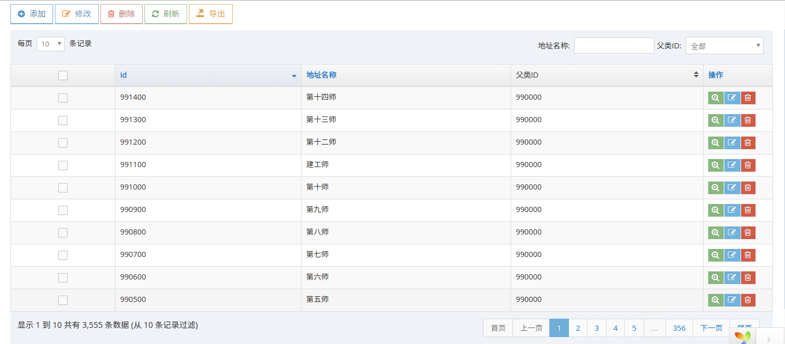

meTables.js 基于 jquery.dataTables.js 表格
===================================

### 简介

因为jquery.dataTables.js 只是显示数据，没有自带的编辑、新增、删除数据的功能，需要依靠扩展实现，所以自己写了一个编辑、新增、删除数据的个功能

### 依赖声明
* jQuery v2.1.1 
* Bootstrap v3.2.0
* DataTables 1.10.10
* layer-v2.1
* jQuery Validation Plugin - v1.14.0

### 简单使用
#### js 
```js
var mt = meTables({
    title: "地址信息",
    table: {
        "aoColumns":[
            {"title": "id", "data": "id", "sName": "id",  "defaultOrder": "desc",
                "edit": {"type": "text", "required":true,"number":true}
            },
            {"title": "地址名称", "data": "name", "sName": "name",
                "edit": {"type": "text", "required": true, "rangelength":"[2, 40]"},
                "search": {"type": "text"},
                "bSortable": false
            },
            {"title": "父类ID", "data": "pid", "sName": "pid", "value": {"0": "中国", "1": "上海"},
                "edit": {"type": "text", "required": true, "number": true},
                "search": {"type":"select"}
            }
        ]
    }
});
```
#### html
```html
<p id="me-table-buttons"></p>
<table class="table table-striped table-bordered table-hover" id="show-table"></table>
```
#### 生成视图


#### 服务器返回数据说明
* 查询返回json
```
{
  errCode: 0, 
  errMsg: "操作成功", 
  data: {
    sEcho: 1,                   // 查询次数
    iTotalRecords: 10,          // 当页数据条数
    iTotalDisplayRecords: 100,  // 数据总条数 
    aaData: [                   // 数据
      {id: 1, name: "中国"},
      {id: 2, name: "上海"}
    ]
  }
}
```
* 新增、修改、删除返回json
1. 处理成功
```
{
    errCode: 0,
    errMsg: "操作成功",
    data: {
        id: 1,
        name: "中国"
    }
}
```
2. 处理失败
```js
{
  errCode: 1,
  errMsg: "处理失败",
  data: null
}
```
### 配置说明

* 在 meTables() 函数中传递的对象信息会覆盖如下的默认配置信息
* 选择器配置一定要使用ID选择器，例如：sModal, sTable, sFormId, searchForm, buttonSelector
```js
var config = {
    title: "",                  // 表格的标题  
    language: "zh-cn",          // 使用语言          
    pk: "id",		            // 行内编辑、多选删除、多选编辑 pk索引值
    sModal: "#table-modal",     // 编辑Modal选择器
    sTable:  "#show-table", 	// 显示表格选择器
    sFormId: "#edit-form",		// 编辑表单选择器
    sMethod: "POST",			// 查询数据的请求方式
    bCheckbox: true,			// 需要多选框
    params: null,				// 请求携带参数
    ajaxRequest: false,         // ajax一次性获取数据
    
    // 关于地址配置信息
    urlPrefix: "", 
    urlSuffix: "",
    url: {
        search: "search",
        create: "create",
        update: "update",
        delete: "delete",
        export: "export",
        upload: "upload",
        editable: "editable",
        deleteAll: "delete-all"
    },
    
    // 最终生成地址 urlPrefix + url.search + urlSuffix;
             
    // dataTables 表格默认配置对象信息
    table: {
        // "fnServerData": fnServerData,		// 获取数据的处理函数
        // "sAjaxSource":      "search",		// 获取数据地址
        "bLengthChange": true, 			// 是否可以调整分页
        "bAutoWidth": false,           	// 是否自动计算列宽
        "bPaginate": true,			    // 是否使用分页
        "iDisplayStart":  0,
        "iDisplayLength": 10,
        "bServerSide": true,		 	// 是否开启从服务器端获取数据
        "bRetrieve": true,
        "bDestroy": true,
        // "processing": true,		    // 是否使用加载进度条
        // "searching": false,
        "sPaginationType":  "full_numbers"     // 分页样式
        // "order": [[1, "desc"]]       // 默认排序，
        // sDom: "t<'row'<'col-xs-6'li><'col-xs-6'p>>"
    },

    // 关于搜索的配置
    searchHtml: "",				// 搜索信息额外HTML
    searchType: "middle",		// 搜索表单位置
    searchForm: "#search-form",	// 搜索表单选择器

    // 搜索信息(只对searchType !== "middle") 情况
    search: {
        render: true,           // 是否渲染表格，自己创建了搜索表单，可以将该值设置为false
        type: "append",         // 渲染时添加表单html的jquery 函数方式
        // 搜索按钮
        button: {
            "class": "btn btn-info btn-sm", // 搜索按钮class
            "icon": "ace-icon fa fa-search" // 搜索按钮的icon
        }
    },

    // 上传文件选择器， 依赖ace.min.js 中的 ace_file_input() 函数
    fileSelector: [],			

    // 编辑表单信息
    form: {
        "method": "post", 
        "class":  "form-horizontal",
        "name":   "edit-form"
    },

    // 编辑表单验证方式（jquery.validate 需要的验证对象信息）
    formValidate: {
        errorElement: 'div',
        errorClass: 'help-block',
        focusInvalid: false,
        highlight: function (e) {
            $(e).closest('.form-group').removeClass('has-info').addClass('has-error');
        },
        success: function (e) {
            $(e).closest('.form-group').removeClass('has-error');//.addClass('has-info');
            $(e).remove();
        }
    },

    // 表单编辑其他信息
    editFormParams: {				// 编辑表单配置
        bMultiCols: false,          // 是否多列
        iColsLength: 1,             // 几列
        aCols: [3, 9],              // label 和 input 栅格化设置
        sModalClass: "",			// 弹出模块框配置
        sModalDialogClass: ""		// 弹出模块的class
    },

    // 关于详情的配置
    bViewFull: false, // 详情打开的方式 1 2 打开全屏
    // layer.open() 函数需要的配置信息
    oViewConfig: {
        type: 1,
        shade: 0.3,
        shadeClose: true,
        maxmin: true,
        area: ['50%', 'auto']
    },

    detailTable: {                   // 查看详情配置信息
        bMultiCols: false,
        iColsLength: 1
    },

    // 子表格配置信息
    bChildTables: false, // 是否开启
    childTables: {
        sTable: "#child-table",
        sModal: "#child-modal",
        sFormId: "#child-form",
        urlPrefix: "",
        urlSuffix: "",
        url: {
            "search": "view",  // 查询
            "create": "create", // 创建
            "update": "update",	// 修改
            "delete": "delete" // 删除
        },
        sClickSelect: "td.child-control",
        table: 	{
            "bPaginate": false,             // 不使用分页
            "bLengthChange": false,         // 是否可以调整分页
            "bServerSide": true,		 	// 是否开启从服务器端获取数据
            "bAutoWidth": false,
            "searching": false,				// 搜索
            "ordering": false			 	// 排序
        },

        detailTable: {                   // 查询详情配置信息
            bMultiCols: false,
            iColsLength: 1
        },

        editFormParams: {				// 编辑表单配置
            bMultiCols: false,          // 是否多列
            iColsLength: 1,             // 几列
            aCols: [3, 9],              // label 和 input 栅格化设置
            sModalClass: "",			// 弹出模块框配置
            sModalDialogClass: ""		// 弹出模块的class
        }
    },

    // 开启行处理
    editable: null,

    // 默认按钮信息
    buttonHtml: "",
    // 按钮添加容器
    buttonSelector: "#me-table-buttons",
    // 按钮添加方式
    buttonType: "append",
    // 默认按钮信息
    buttons: {
        // 添加数据
        create: {
            bShow: true, // 是否显示出来
            icon: "ace-icon fa fa-plus-circle blue",
            className: "btn btn-white btn-primary btn-bold"
        },
        
        // 多选编辑
        updateAll: {
            bShow: true,
            icon: "ace-icon fa fa-pencil-square-o orange",
            className: "btn btn-white btn-info btn-bold"
        },
        
        // 多选删除
        deleteAll: {
            bShow: true,
            icon: "ace-icon fa fa-trash-o red",
            className: "btn btn-white btn-danger btn-bold"
        },
        
        // 刷新表格
        refresh: {
            bShow: true,
            icon: "ace-icon fa  fa-refresh",
            className: "btn btn-white btn-success btn-bold"
        },
        
        // 导出数据
        export: {
            bShow: true,
            icon: "ace-icon glyphicon glyphicon-export",
            className: "btn btn-white btn-warning btn-bold"
        }
    }

    // 操作选项
    ,operations: {
        isOpen: true, // 是否显示
        width: "120px",
        defaultContent: "",
        buttons: {
            "see": {"className": "btn-success", "cClass":"me-table-detail",  "icon":"fa-search-plus",  "sClass":"blue"},
            "update": {"className": "btn-info", "cClass":"me-table-update", "icon":"fa-pencil-square-o",  "sClass":"green"},
            "delete": {"className": "btn-danger", "cClass":"me-table-delete", "icon":"fa-trash-o",  "sClass":"red"}
        }
    }
};

```