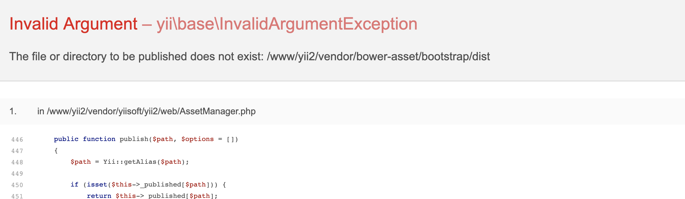

FAQ
===

以下整理了一些常见的问题，在提问之前建议找找有没有类似的问题。

## 一 `composer` 安装问题(安装慢、或者有错误)

1. 确认安装了[Composer Asset插件](https://github.com/fxpio/composer-asset-plugin)
2. `composer` 使用[中国镜像](https://pkg.phpcomposer.com/)
3. 不使用`composer`,直接下载打包文件
   * [百度网盘](https://pan.baidu.com/s/1frc7FxxL1Pkf2dd06m0tlA)
   * [有道云笔记](https://note.youdao.com/ynoteshare1/index.html?id=4e1e59dd2ec2541796105d4d7afdb3c9)
   * [CSDN](https://download.csdn.net/download/myliujx/11193963)
   
### 安装完成，报目录不存在错误



直接`cp` `vendor`目录下 `bower` 目录更名为 `bower-asset`


## 二 连表操作怎么办？

在控制器中重写 `getQuery`方法

```php
public function getQuery($where)
{
    return Admin::find()->select(['*'])
                ->innerJoin('admin_operate_logs', 'admin.id = admin_operate_logs.admin_id')
                ->where($where)
                ->asArray();
}
```

能使用关联查询的请使用关联

```php
public function getQuery($where)
{
    return Customer::find()->with('orders', 'country')->where($where)->asArray();
}
```

## 三 怎么将请求参数传递到`search`方法的查询条件?

1. 控制器`actionIndex`方法接收请求参数,传递到视图(或者直接在视图里面接收)

    ```php
    public function actionIndex()
    {
        $id = Yii::$app->request->get('id');
        return $this->render('index', compact('id'));
    }
    ```

2. 视图文件中，配置`meTables`的附加参数

    ```php
    var m = meTables({
        params: {
            id: <?php echo isset($id) ? $id : 'null' ?>,
        }
    })
    ```
    
## 四 前端`meTables`配置相关问题

### 4.1 视图怎么控制创建和修改表单不一致?

通过 `meTables` 的`beforeShow` 方法实现，控制某个`input`的显示和隐藏

```js
var m = meTables({
    table: {
        columns: [
            {
                title: "用户名称",
                data: "username",
                edit: {
                    id: "username"
                }
            }
        ]
    }
});

// 用户名字段在创建的时候显示出来，修改的时候隐藏起来
$.extend(m, {
    beforeShow: function() {
        if (this.action === "update") {
            $("#username").attr('disable', true).hide();
        } else  {
            $("#username").attr('disable', false).show();
        }
    }
});
```

### 4.2 操作项指定按钮在特定情况下显示

配置指定按钮的`show`方法

`show`函数接受一个参数`rows`(这一行的数据)，需要返回`true`来确定显示

```js
var m = meTables({
    operations: {
        buttons: {
            // 配置show，根据情况显示删除 rows 表示这一行的数据
            delete: {
                show: function (rows) {
                    return rows.status == 1;
                }
            }
        }
    }
})
```

### 4.3 怎么为搜索`select`,编辑`select`,`radio`提供数据

配置那一列的`value`，数据格式为 `object` `{value1:label1, value2: label2}`

```js
m = meTables({
    title: "用户信息",
    table: {
        columns: [
            {
                title: "状态",
                data: "status", 
                edit: {type: "select"},
                search: {type: "select"},
                value: {
                  1: "启用",
                  2: "停用"  
                },
                sortable: false
            }
         ]
    }
})

```

[更多`meTabls`说明>>](./metables.md)

## 五 控制器相关问题

### 5.1 查询数据问题

前端需要配置搜索`input`, 就是每一列的 `search` 配置项

控制器需要定义`where`方法处理查询

```php
public function where()
{
    
    return [
        // 第一个元素定义查询字段，第二个元素定义查询方式
        ['status', '='],
    ];
}
```
>为什么需要`where`来处理查询方式，主要为了简化前端工作，让后端来处理复杂查询

1. 比如前端一个搜索框，`name` 为 `username`, 需要后端同时搜索用户名、用户昵称、邮箱
```php
public function where()
{
    return [
        ['username', function ($value) {
            return [
                'or', 
                ['like', 'username', $value], 
                ['like', 'nickname', $value],
                ['like', 'email', $value],
            ];
        }]
    ];
}
```

2. `where`可以定义默认的查询条件
```php
public function where()
{
    return [
        // 注意 where 为一个二维数组
        'where' => [['=', 'status', 1]],
        
        // 其他请求查询条件 
        [['username', 'email'], 'like'], // username、email 都使用 like 查询
    ];
}
```